# Dataset Generation Guide

## Overview

This guide provides a comprehensive reference for generating the DocuNative synthetic dataset. We generate **120 legal documents** across 4 domains, 3 languages, and 10 documents per domain-language pair. These documents are used to evaluate cross-lingual document QA systems.

**Dataset Scale:** 4 domains × 3 languages × 10 documents = **120 total documents**

**Target Languages:**
- **German (de)** - High-resource language
- **Hindi (hi)** - Medium-resource language
- **Swahili (sw)** - Low-resource language

**Document Domains:**
1. Lease Agreements
2. Employment Contracts
3. Health Insurance Documents
4. Immigration Letters

---

## Document Sources

This section provides curated sources of real legal documents that serve as references for generating realistic synthetic documents. Study these sources to understand authentic formatting, terminology, and structure.

### 1. Lease Agreements / Rental Contracts

#### German (de)

| Source | URL | Type | Usage Notes |
|--------|-----|------|-------------|
| **Deutscher Mieterbund** | https://www.mieterbund.de/ | Official tenant association | Template lease agreements, standard clauses for rent, deposits, notice periods |
| **IHK (Chamber of Commerce)** | https://www.ihk.de/ | Business/commercial templates | Commercial lease structures, official formatting |
| **Bundesministerium der Justiz** | https://www.gesetze-im-internet.de/ | Government legal database | Legal terminology, regulatory references (BGB §§) |
| **Immobilienscout24** | https://www.immobilienscout24.de/wissen/mieten/ | Real estate portal | Sample rental agreements, common clauses |

**Key Elements:** Rent amount (Miete), deposit (Kaution), notice period (Kündigungsfrist), pet policy (Haustierhaltung), maintenance obligations (Instandhaltung)

#### Hindi (hi)

| Source | URL | Type | Usage Notes |
|--------|-----|------|-------------|
| **IndiaFilings** | https://www.indiafilings.com/ | Legal services platform | Rental agreement templates, Hindi legal terminology |
| **LawRato** | https://lawrato.com/ | Legal document library | Sample rental deeds (किराया समझौता), Hindi-English mixed format |
| **Government of India - Housing** | https://mohua.gov.in/ | Ministry of Housing | Official rental policies, legal framework |
| **NoBroker Legal** | https://www.nobroker.in/legal-services | Real estate legal services | Sample agreements, common Hindi terms |

**Key Elements:** Rent (किराया), security deposit (जमा राशि), duration (अवधि), maintenance charges (रखरखाव शुल्क)

#### Swahili (sw)

| Source | URL | Type | Usage Notes |
|--------|-----|------|-------------|
| **Tanzania Government Portal** | https://www.tanzania.go.tz/ | Official government | Legal document formats, Swahili administrative language |
| **Kenya Law Portal** | http://kenyalaw.org/ | Legal information | East African legal documents, Swahili legal terms |
| **Sheria ya Tanzania** | Various Tanzania legal sites | Legal resources | Rental law terminology (Sheria ya Kupanga) |
| **TUKI (Taasisi ya Uchunguzi wa Kiswahili)** | https://tuki.or.tz/ | Swahili language institute | Proper Swahili terminology, formal language |

**Key Elements:** Rent (kodi), deposit (dhamana), period (kipindi), tenant (mpangaji), landlord (mwenye nyumba)

---

### 2. Employment Contracts

#### German (de)

| Source | URL | Type | Usage Notes |
|--------|-----|------|-------------|
| **Bundesagentur für Arbeit** | https://www.arbeitsagentur.de/ | Federal Employment Agency | Employment contract templates, labor law references |
| **IHK Employment Resources** | https://www.ihk.de/arbeitsrecht | Chamber of Commerce | Standard employment agreement formats |
| **Bundesministerium für Arbeit** | https://www.bmas.de/ | Ministry of Labor | Official labor law documents, terminology |
| **Haufe Personnel** | https://www.haufe.de/personal/ | HR/Legal publisher | Professional employment contracts, clauses |

**Key Elements:** Salary (Gehalt), working hours (Arbeitszeit), probation period (Probezeit), vacation days (Urlaubstage), notice period (Kündigungsfrist)

#### Hindi (hi)

| Source | URL | Type | Usage Notes |
|--------|-----|------|-------------|
| **ClearTax Employment** | https://cleartax.in/ | Tax and employment | Employment agreement templates, salary structures |
| **Ministry of Labour & Employment** | https://labour.gov.in/ | Government ministry | Labor law references, official terminology |
| **IndiaFilings Employment** | https://www.indiafilings.com/learn/employment-agreement/ | Legal templates | Hindi employment contracts, PF/ESI clauses |
| **PeopleStrong Legal** | https://www.peoplestrong.com/ | HR platform | Sample employment letters, Hindi terminology |

**Key Elements:** Salary (वेतन), designation (पदनाम), joining date (कार्यग्रहण तिथि), benefits (लाभ), termination (समाप्ति)

#### Swahili (sw)

| Source | URL | Type | Usage Notes |
|--------|-----|------|-------------|
| **Tanzania Employment Law** | Tanzania labor ministry sites | Government resources | Employment contracts, Sheria ya Ajira |
| **Kenya Federation of Employers** | https://www.fke-kenya.org/ | Employers' federation | Standard employment forms, East African format |
| **ILO Tanzania** | https://www.ilo.org/africa/countries-covered/tanzania/ | International Labour Org | Labor standards, Swahili employment terminology |

**Key Elements:** Salary (mshahara), contract (mkataba), duties (majukumu), benefits (manufaa), termination (kusitishwa kwa kazi)

---

### 3. Health Insurance Documents

#### German (de)

| Source | URL | Type | Usage Notes |
|--------|-----|------|-------------|
| **Bundesministerium für Gesundheit** | https://www.bundesgesundheitsministerium.de/ | Ministry of Health | Official health insurance frameworks, terminology |
| **GKV-Spitzenverband** | https://www.gkv-spitzenverband.de/ | Statutory health insurance | Insurance policy templates, coverage details |
| **TK (Techniker Krankenkasse)** | https://www.tk.de/ | Major health insurer | Sample policy documents, coverage descriptions |
| **AOK Gesundheitskasse** | https://www.aok.de/ | Public health insurer | Insurance certificates, member documents |

**Key Elements:** Insurance number (Versicherungsnummer), coverage (Versicherungsschutz), premium (Beitrag), benefits (Leistungen), co-payment (Zuzahlung)

#### Hindi (hi)

| Source | URL | Type | Usage Notes |
|--------|-----|------|-------------|
| **IRDAI (Insurance Regulatory Authority)** | https://www.irdai.gov.in/ | Regulatory body | Official insurance terminology, policy formats |
| **National Health Authority** | https://pmjay.gov.in/ | Government health insurance | Policy documents, Hindi health terms |
| **Insurance Company Portals** | Various (LIC, ICICI Prudential) | Insurance providers | Sample health policies, coverage details |
| **Ministry of Health India** | https://www.mohfw.gov.in/ | Health ministry | Health insurance schemes, official terminology |

**Key Elements:** Policy number (पॉलिसी संख्या), coverage (कवरेज), premium (प्रीमियम), claim (दावा), beneficiary (लाभार्थी)

#### Swahili (sw)

| Source | URL | Type | Usage Notes |
|--------|-----|------|-------------|
| **Tanzania Insurance Regulatory Authority** | https://www.tira.go.tz/ | Regulatory authority | Insurance frameworks, Swahili terminology |
| **National Health Insurance Fund (NHIF)** | NHIF Tanzania/Kenya portals | Public health insurance | Member documents, coverage certificates |
| **East African Community Health** | EAC health resources | Regional resources | Health insurance across East Africa |

**Key Elements:** Policy (bima), coverage (ulinzi), premium (malipo), claim (madai), member (mwanachama)

---

### 4. Immigration Letters / Permits

#### German (de)

| Source | URL | Type | Usage Notes |
|--------|-----|------|-------------|
| **Ausländerbehörde** | Local foreign office websites | Government immigration | Residence permit documents, visa letters |
| **Bundesamt für Migration (BAMF)** | https://www.bamf.de/ | Federal migration office | Official immigration documents, terminology |
| **Make-it-in-Germany** | https://www.make-it-in-germany.com/ | Government portal | Work permit information, visa types |
| **German Missions Abroad** | Various embassy sites | Diplomatic missions | Visa application documents, official letters |

**Key Elements:** Permit type (Aufenthaltserlaubnis), validity (Gültigkeit), work authorization (Arbeitserlaubnis), purpose (Zweck), restrictions (Auflagen)

#### Hindi (hi)

| Source | URL | Type | Usage Notes |
|--------|-----|------|-------------|
| **Ministry of Home Affairs** | https://www.mha.gov.in/ | Immigration authority | Visa documents, permit letters |
| **Bureau of Immigration** | https://boi.gov.in/ | Immigration bureau | Official immigration forms, terminology |
| **e-FRRO Portal** | https://indianfrro.gov.in/ | Foreigner registration | Registration documents, permits |
| **Indian Missions** | Various embassy websites | Diplomatic posts | Visa letters, official communication |

**Key Elements:** Visa type (वीजा प्रकार), validity (वैधता), purpose (उद्देश्य), permit (अनुमति), registration (पंजीकरण)

#### Swahili (sw)

| Source | URL | Type | Usage Notes |
|--------|-----|------|-------------|
| **Tanzania Immigration Services** | https://www.immigration.go.tz/ | Immigration department | Permit documents, visa letters |
| **Kenya Immigration** | https://www.immigration.go.ke/ | Immigration services | Work permits, residence documents |
| **EAC Migration** | East African Community resources | Regional migration | Cross-border permits, Swahili terminology |

**Key Elements:** Permit (kibali), visa (visa), residence (makazi), work (kazi), validity (uhalali)

---

## Pipeline Architecture

The dataset generation pipeline consists of five stages, transforming real document patterns into synthetic multilingual legal documents.

```mermaid
graph LR
    RealDocs[Real Document<br/>Sources] -->|Study Structure<br/>& Terminology| Reference[Reference<br/>Analysis]
    Reference -->|Extract Patterns| Facts[facts.py<br/>Issue #28]
    Facts -->|Generate<br/>Structured Facts| Writer[writer.py<br/>Issue #17]
    Writer -->|API Request| Cohere[Cohere API<br/>Aya Expanse 35B]
    Cohere -->|Generated Text| Validation[Quality<br/>Validation]
    Validation -->|Store| Output[JSONL<br/>Output]
    
    style Facts fill:#e1f5ff
    style Writer fill:#e1f5ff
    style Cohere fill:#fff4e1
    style Output fill:#e8f5e9
```



### Pipeline Stages

#### Stage 1: Reference Collection
**Purpose:** Study real documents to understand authentic patterns

**Activities:**
- Review document sources listed above for each domain and language
- Identify common structural elements (headers, sections, signatures)
- Extract domain-specific terminology and legal phrases
- Note formatting conventions (date formats, currency, numbering)
- Understand cultural and legal context for each language

**Output:** Mental model and reference notes for realistic document generation

---

#### Stage 2: Facts Generation
**Component:** `dataset/builder/facts.py` (Issue #28 - ✅ Merged)

**Purpose:** Generate structured factual blueprints for each document

**Process:**
- For each combination of (domain, language, document_index), generate a facts dictionary
- Facts include all key data points: rent amounts, salaries, dates, names, addresses
- Uses deterministic random generation (with seeds) for reproducibility
- Facts are language-neutral (e.g., amounts in numbers, dates in ISO format)

**Example Facts Dict:**
```python
{
    "_language": "de",
    "_domain": "lease",
    "_document_index": 3,
    "_seed": 42,
    "rent_amount": 1350.00,
    "currency": "EUR",
    "deposit": 2700.00,
    "notice_period_days": 60,
    "pets_allowed": False,
    "tenant_name": "Maria Schmidt",
    "landlord_name": "Immobilien GmbH",
    "address": "Hauptstraße 45, 10115 Berlin",
    "start_date": "2025-04-01",
    "contract_duration_months": 24
}
```

---

#### Stage 3: Document Synthesis
**Component:** `dataset/builder/writer.py` (Issue #17 - To be implemented)

**Purpose:** Transform facts into realistic legal document text via Cohere API

**Process:**
1. Receive facts dictionary from facts.py
2. Construct prompt for Cohere API that includes:
   - Target language instruction
   - Document type/domain
   - All factual constraints from the facts dict
   - Reference patterns from real documents
   - Length guidance (1-5 pages)
3. Call Aya Expanse 35B via Cohere API
4. Receive generated document text

**API Configuration:**
- Model: Aya Expanse 35B (multilingual specialist)
- API credits: Confirmed available
- This is the **only internet-dependent step** in the pipeline

---

#### Stage 4: Quality Validation
**Purpose:** Ensure generated documents meet quality standards

**Validation Checks:**
- Document length: 1-5 pages (variable)
- Language correctness: Text is in the target language
- Fact inclusion: All key facts from the facts dict are present
- Realistic formatting: Document structure matches domain conventions
- Legal authenticity: Appropriate terminology and legal language

---

#### Stage 5: Output Storage
**Purpose:** Store generated documents with complete metadata

**Output Format:** JSONL (one JSON object per line)

**Schema:**
```json
{
  "doc_id": "lease_de_003",
  "language": "de",
  "domain": "lease",
  "document_index": 3,
  "document_text": "MIETVERTRAG\n\nzwischen...",
  "seed": 42,
  "facts": {
    "rent_amount": 1350.00,
    "currency": "EUR",
    ...
  },
  "metadata": {
    "generated_date": "2026-03-16",
    "model": "aya-expanse-35b",
    "page_count": 3
  }
}
```

**Output Location:** `dataset/output/documents.jsonl`

---

## Implementation Guide

### Complete Generation Loop

```python
from dataset.builder.facts import generate_facts, SUPPORTED_DOMAINS
from dataset.builder.writer import generate_document
import json

# Constants
SUPPORTED_DOMAINS = ["lease", "employment", "health_insurance", "immigration_letter"]
LANGUAGES = ["de", "hi", "sw"]
DOCS_PER_COMBINATION = 10

# Output file
output_file = "dataset/output/documents.jsonl"

# Generate all 120 documents
with open(output_file, "w", encoding="utf-8") as f:
    for domain in SUPPORTED_DOMAINS:
        for lang in LANGUAGES:
            for doc_idx in range(DOCS_PER_COMBINATION):
                # Stage 2: Generate facts
                facts = generate_facts(lang, domain, doc_idx)
                
                # Stage 3: Generate document via Cohere API
                document_text = generate_document(facts)
                
                # Stage 5: Create output record
                record = {
                    "doc_id": f"{domain}_{lang}_{doc_idx:03d}",
                    "language": facts["_language"],
                    "domain": facts["_domain"],
                    "document_index": facts["_document_index"],
                    "document_text": document_text,
                    "seed": facts["_seed"],
                    "facts": facts
                }
                
                # Write to JSONL
                f.write(json.dumps(record, ensure_ascii=False) + "\n")
                
                print(f"✓ Generated {record['doc_id']}")

print(f"✅ Complete! Generated 120 documents → {output_file}")
```

### Facts Dictionary Structure

The `generate_facts()` function returns a dictionary with metadata and domain-specific facts:

**Common Fields (all domains):**
```python
{
    "_language": str,        # "de" | "hi" | "sw"
    "_domain": str,          # "lease" | "employment" | "health_insurance" | "immigration_letter"
    "_document_index": int,  # 0-9
    "_seed": int,            # Random seed for reproducibility
}
```

**Domain-Specific Fields:**

**Lease:**
- `rent_amount`, `currency`, `deposit`, `notice_period_days`, `pets_allowed`, `tenant_name`, `landlord_name`, `address`, `start_date`, `contract_duration_months`

**Employment:**
- `salary`, `currency`, `job_title`, `employee_name`, `employer_name`, `start_date`, `probation_months`, `vacation_days`, `working_hours_per_week`, `notice_period_days`

**Health Insurance:**
- `policy_number`, `premium_amount`, `currency`, `coverage_type`, `insured_name`, `insurer_name`, `policy_start_date`, `coverage_amount`, `deductible`

**Immigration:**
- `permit_type`, `permit_number`, `applicant_name`, `nationality`, `issue_date`, `expiry_date`, `purpose`, `work_authorized`, `restrictions`

### Prompt Engineering for writer.py

When calling the Cohere API, structure prompts to leverage real document patterns:

```python
def generate_document(facts: dict) -> str:
    """Generate a realistic legal document from facts using Cohere API."""
    
    lang = facts["_language"]
    domain = facts["_domain"]
    
    # Build prompt with reference patterns
    prompt = f"""Generate a realistic {domain} document in {get_language_name(lang)}.

This document should follow authentic legal formatting conventions used in real {domain} documents.

Required facts to include:
{format_facts_for_prompt(facts)}

Requirements:
- Use proper legal terminology and formal language for {get_language_name(lang)}
- Include appropriate document structure (title, sections, clauses, signatures)
- Document length: between 1 and 5 pages
- Use authentic formatting (dates, currency, addresses) appropriate to the language
- Include all facts naturally within the document text

Generate only the document text, no additional commentary.
"""
    
    # Call Cohere API
    response = cohere_client.generate(
        model="aya-expanse-35b",
        prompt=prompt,
        max_tokens=4000,  # ~3-5 pages
        temperature=0.8,  # Balanced creativity
    )
    
    return response.generations[0].text
```

### Error Handling and Rate Limiting

```python
import time
from tenacity import retry, stop_after_attempt, wait_exponential

@retry(stop=stop_after_attempt(3), wait=wait_exponential(multiplier=1, min=4, max=10))
def generate_document_with_retry(facts: dict) -> str:
    """Generate document with automatic retry on failures."""
    try:
        return generate_document(facts)
    except Exception as e:
        print(f"⚠️  Error generating {facts['_domain']}_{facts['_language']}_{facts['_document_index']}: {e}")
        raise

# Rate limiting: avoid overwhelming API
def generate_all_documents():
    for domain in SUPPORTED_DOMAINS:
        for lang in LANGUAGES:
            for doc_idx in range(10):
                facts = generate_facts(lang, domain, doc_idx)
                document = generate_document_with_retry(facts)
                save_document(facts, document)
                
                # Rate limit: 1 request per second
                time.sleep(1)
```

---

## Quality Guidelines

### Best Practices for Realistic Documents

#### 1. Study Real Document Formatting

Before generating documents, carefully review sources for each domain and language:

**Structural Elements to Note:**
- **Headers:** Official letterheads, document titles, reference numbers
- **Sections:** How documents are divided (clauses, articles, paragraphs)
- **Signatures:** Placement and format of signature blocks
- **Dates:** Format conventions (DD.MM.YYYY for German, DD/MM/YYYY for Hindi/English)
- **Numbering:** Clause numbering systems (§, Article, Section)

**Example - German Lease:**
```
MIETVERTRAG

zwischen

[Landlord details]
- nachfolgend "Vermieter" -

und

[Tenant details]
- nachfolgend "Mieter" -

wird folgender Mietvertrag geschlossen:

§ 1 Mietobjekt
...

§ 2 Mietzins und Nebenkosten
...
```

#### 2. Use Domain-Specific Terminology

Each domain has specialized vocabulary. Reference the document sources for authentic terms:

**German Lease Terms:**
- Miete (rent), not Zahlung (payment)
- Kaution (deposit), not Pfand (pledge)
- Kündigungsfrist (notice period), not Warnzeit (warning time)

**Hindi Employment Terms:**
- वेतन (vetana - salary), not पैसा (paisa - money)
- पदनाम (padanama - designation), not नौकरी (naukari - job)
- कार्यग्रहण (karyagrahana - joining), not शुरुआत (shuruaat - start)

**Swahili Immigration Terms:**
- Kibali cha kukaa (residence permit), not Hati ya kukaa
- Uhalali (validity), not Muda
- Ajira (employment), not Kazi (general work)

#### 3. Variable Document Length (1-5 Pages)

Real legal documents vary significantly in complexity and length. Introduce variability:

**Short Documents (1-2 pages):**
- Simple immigration letters
- Basic health insurance certificates
- Short-term rental agreements

**Medium Documents (2-3 pages):**
- Standard employment contracts
- Typical lease agreements
- Standard health policies

**Long Documents (4-5 pages):**
- Complex commercial leases
- Senior-level employment contracts
- Comprehensive health insurance policies
- Detailed immigration permits

**Implementation in Prompt:**
```python
length_guidance = random.choice([
    "a concise 1-2 page document",
    "a standard 2-3 page document",
    "a detailed 3-4 page document",
    "a comprehensive 4-5 page document"
])

prompt = f"Generate {length_guidance} for a {domain}..."
```

#### 4. Cultural and Legal Context

Each language has cultural and legal context that should be reflected:

**German:**
- Formal "Sie" form throughout legal documents
- References to BGB (Bürgerliches Gesetzbuch - Civil Code)
- Precision and formality in language
- Official stamps and registration references

**Hindi:**
- Mix of Hindi and English terms (common in legal documents)
- References to Indian legal acts (e.g., "भारतीय अनुबंध अधिनियम, 1872")
- Use of respectful titles (श्री/श्रीमती)
- Date formats: both DD/MM/YYYY and Hindi calendar references

**Swahili:**
- Formal Swahili (not colloquial)
- References to local laws ("Sheria ya...")
- East African context (Tanzania, Kenya, Uganda)
- Use of proper titles (Mheshimiwa, Ndugu)

#### 5. Maintain Fact Consistency

Every fact in the facts dictionary MUST appear in the generated document:

**Verification Checklist:**
- [ ] All names appear correctly
- [ ] All amounts match exactly
- [ ] All dates are included
- [ ] All durations/periods are specified
- [ ] All boolean flags are reflected (e.g., pets_allowed)

**Example Validation:**
```python
def validate_document(facts: dict, document: str) -> bool:
    """Verify all facts appear in the generated document."""
    
    checks = []
    
    # Check numerical facts
    if "rent_amount" in facts:
        checks.append(str(facts["rent_amount"]) in document)
    
    # Check names
    if "tenant_name" in facts:
        checks.append(facts["tenant_name"] in document)
    
    # Check dates
    if "start_date" in facts:
        date_formats = [
            facts["start_date"],  # ISO format
            format_date_localized(facts["start_date"], facts["_language"])
        ]
        checks.append(any(df in document for df in date_formats))
    
    return all(checks)
```

#### 6. Language Quality Standards

**Grammar and Spelling:**
- Use native speakers or high-quality translation resources
- Verify legal terminology with official sources
- Ensure consistent use of formal/informal registers

**Formatting:**
- Proper use of diacritics (German umlauts: ä, ö, ü, ß)
- Correct Hindi Devanagari script formatting
- Proper Swahili orthography

**Legal Language:**
- Use passive voice where appropriate for formal documents
- Include standard legal phrases ("hereinafter referred to as", "in accordance with")
- Follow jurisdiction-specific conventions

#### 7. Realistic Edge Cases

Include realistic variations and edge cases:

**Lease Documents:**
- Some with parking spaces, some without
- Pet policies: allowed/not allowed/with restrictions
- Furnished vs unfurnished
- Individual vs corporate landlords

**Employment Contracts:**
- Fixed-term vs permanent contracts
- Full-time vs part-time
- Remote work clauses (modern documents)
- Probation periods varying from 1-6 months

**Health Insurance:**
- Individual vs family coverage
- Different coverage tiers (basic, comprehensive)
- Pre-existing condition clauses
- Different premium payment frequencies

**Immigration:**
- Student vs work vs family reunion permits
- Different validity periods
- Work restrictions vs unrestricted
- Single vs multiple entry

---

## API Integration Notes

### Cohere API Setup

```python
import cohere

# Initialize Cohere client
co = cohere.Client(api_key="YOUR_API_KEY")

# Aya Expanse 35B is optimized for multilingual tasks
MODEL = "aya-expanse-35b"
```

### Recommended API Parameters

```python
response = co.generate(
    model="aya-expanse-35b",
    prompt=prompt,
    max_tokens=4000,      # ~3-5 pages of text
    temperature=0.8,       # Balanced: not too random, not too deterministic
    k=0,                   # Disable top-k sampling (use default)
    p=0.95,                # Top-p nucleus sampling
    frequency_penalty=0.1, # Slight penalty for repetition
    presence_penalty=0.1,  # Encourage diverse content
)

document_text = response.generations[0].text
```

### Cost and Rate Limiting Considerations

**API Credits:**
- Cohere API credits confirmed available for this project
- Cost per document: ~$0.02-0.05 (depending on length)
- Total estimated cost: 120 documents × $0.03 avg = ~$3.60

**Rate Limits:**
- Default: 100 requests per minute
- Recommended: 1 request per second (60/minute) for stability
- Total generation time: 120 documents ÷ 60/minute = ~2 minutes

**Implementation:**
```python
import time

for i, (domain, lang, idx) in enumerate(all_combinations):
    facts = generate_facts(lang, domain, idx)
    document = generate_document(facts)
    save_document(facts, document)
    
    # Progress tracking
    print(f"Progress: {i+1}/120 ({(i+1)/120*100:.1f}%)")
    
    # Rate limiting
    time.sleep(1)  # 1 second between requests
```

### Error Handling

**Common API Errors:**

1. **Rate Limit Exceeded (429):**
```python
if response.status_code == 429:
    wait_time = int(response.headers.get('Retry-After', 60))
    time.sleep(wait_time)
    # Retry request
```

2. **Invalid Request (400):**
```python
# Usually prompt too long or invalid parameters
# Check prompt length and parameter values
```

3. **Authentication Error (401):**
```python
# Verify API key is correct and active
```

4. **Server Error (500):**
```python
# Retry with exponential backoff
# If persists, contact Cohere support
```

### Prompt Engineering Tips

**For Legal Documents:**

1. **Be Specific About Format:**
   - "Generate a formal German rental agreement with standard sections..."
   - "Include a proper document header with reference number..."

2. **Specify Cultural Context:**
   - "Use formal German legal language appropriate for official contracts..."
   - "Follow Indian legal document conventions..."

3. **Emphasize Fact Inclusion:**
   - "The document MUST include the following exact details: [facts]"
   - "Ensure all numerical values and dates appear exactly as specified"

4. **Control Length:**
   - "Generate a 2-3 page document..."
   - "Create a comprehensive document of approximately 1000-1500 words..."

5. **Request Authentic Structure:**
   - "Use the typical structure of German lease agreements: title, parties, clauses, signatures"
   - "Follow standard Hindi employment contract formatting"

### Monitoring Generation Quality

Track key metrics during generation:

```python
metrics = {
    "total_generated": 0,
    "failed_generations": 0,
    "avg_length_chars": 0,
    "fact_validation_passes": 0,
    "by_language": {"de": 0, "hi": 0, "sw": 0},
    "by_domain": {d: 0 for d in SUPPORTED_DOMAINS}
}

# Update after each generation
metrics["total_generated"] += 1
metrics["by_language"][lang] += 1
metrics["by_domain"][domain] += 1

# Log every 10 documents
if metrics["total_generated"] % 10 == 0:
    print(f"Generated {metrics['total_generated']}/120")
    print(f"Success rate: {(1 - metrics['failed_generations']/metrics['total_generated'])*100:.1f}%")
```

---

## Appendix

### Dataset Statistics

**Total Documents:** 120

**Distribution:**
- German: 40 documents (4 domains × 10 each)
- Hindi: 40 documents (4 domains × 10 each)
- Swahili: 40 documents (4 domains × 10 each)

**Per Domain:**
- Lease Agreements: 30 documents (3 languages × 10 each)
- Employment Contracts: 30 documents (3 languages × 10 each)
- Health Insurance: 30 documents (3 languages × 10 each)
- Immigration Letters: 30 documents (3 languages × 10 each)

### File Structure

```
docunative/
├── dataset/
│   ├── builder/
│   │   ├── __init__.py
│   │   ├── facts.py           # Generate structured facts (Issue #28 ✅)
│   │   └── writer.py          # Generate documents via Cohere (Issue #17)
│   ├── output/
│   │   └── documents.jsonl    # Generated dataset
│   └── README.md
├── docs/
│   └── dataset-generation-guide.md  # This document
└── ...
```

### Related Documentation

- [`docs/17.md`](17.md) - Issue #17: writer.py implementation
- [`README.md`](../README.md) - Project overview and setup
- [`README_ROADMAP.md`](../README_ROADMAP.md) - System architecture

### Contributing

When adding new document sources or improving the generation pipeline:

1. **Document Sources:** Add new sources with URLs, type, and usage notes
2. **Code Updates:** Update implementation examples to reflect changes
3. **Quality Guidelines:** Add new best practices based on experience
4. **Validation:** Implement automated checks for document quality

### Support

For questions or issues with dataset generation:
- Review this guide thoroughly
- Check existing issues on GitHub
- Refer to Cohere API documentation: https://docs.cohere.com/

---

**Last Updated:** March 16, 2026
**Authors:** DocuNative Team
**Related Issues:** #17 (writer.py), #28 (facts.py)
